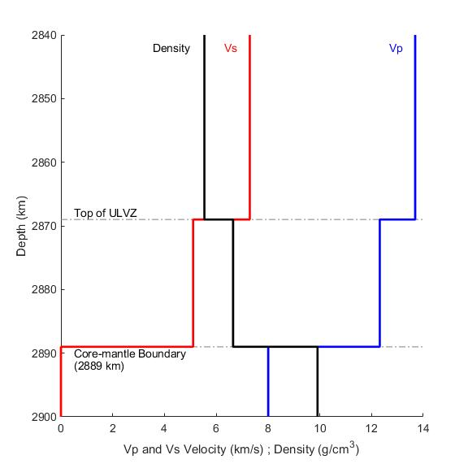

Title: Modeling ScP waveforms with Ultralow Velocity Zones

Tags: ulvz, ScP, CPFrostResearch, seismology

# Modeling ScP waveforms with ultralow velocity zones

This summer my Frost Scholar students are also learning how to model anomalous looking ScP waveforms with _ultralow velocity zone models_ (ULVZ). ULVZ are thin layers atop earth's core-mantle boundary where seismic velocities (P-waves and S-waves) can decrease up to 30%, or more. In some cases an increase in density is also required.

An introduction to ULVZ modeling can be found [here](http://garnero.asu.edu/publications/g072_Garnero,Thorne_SPR2007.pdf).

Below is a figure illustrating a ULVZ model which is 20 km thick, contains P- and S-wave velocity reductions of 10% and 30%, respectively, and a density increase of 20%. The moment tensor of the earthquake has been used in this calculation. The epicentral distance from source to receiver is about 32 degrees, with a source depth of ~100 km. ULVZ models are made by modifying the IASP91 earth model.

One of the first things to do is run a suite of models where only one parameter (P-velocity, S-velocity, density) is varied. In the case shown below, the thickness is 20 km and only shear wave velocity has been decreased, by 20% (dVs = -20%).

The top panel shows the synthetic seismogram output, which has been corrected to velocity (m/s) of a GS-13 seismometer. The bottom panel shows the same waveform but bandpass filtered. It is evident that a density increase within a ULVZ creates a large reversed polarity precursor (1st pulse) to the ScP waveform (2nd pulse). There is also a small post-cursor waveform visible between 765-6 seconds. 

Next up is to finish calculating the synthetic seismograms for variations in each parameter in steps of 5% (up to 50%). This will provide insight into how to model a given observed ScP waveform that contains evidence of ULVZ structure at the core-mantle boundary.